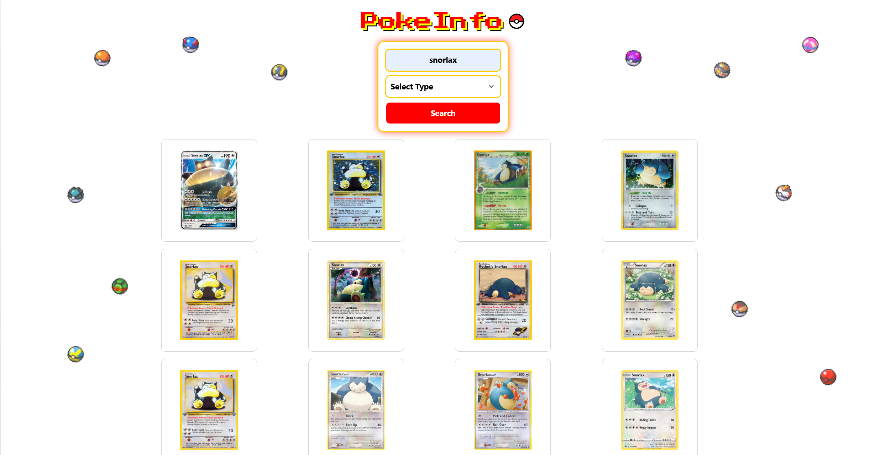
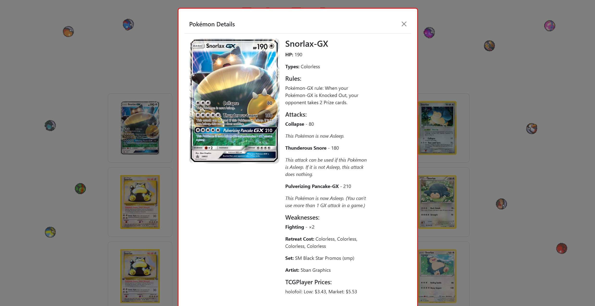

PokeInfo 🃏✨
Pokémon Card Search and Market Price Tracker
PokeInfo is a Pokémon card search tool that allows users to look up Pokémon cards by name and filter them by type. The application retrieves card details, including artwork, attributes, and real-time market prices, providing collectors and enthusiasts with an easy way to browse and assess Pokémon cards.

30 seconds Youtube Video 
[](https://youtu.be/0QuDEThrs70)


🔎 Search for Pokémon Cards by Name



🎨 View Pokémon Card Details 



💰 Check Market Prices

🚀 Features
✔️ Search Pokémon Cards by entering the Pokémon name in the search bar.
✔️ Filter by Type to display cards based on their elemental type (e.g., Fire, Water, Electric).
✔️ View Card Details, including stats, rarity, and set information.
✔️ Check Market Prices for each card to stay updated on its current value.

🛠️ How to Use

1. **Clone the Repository**: 
   ```bash
   git clone https://github.com/alezubi/PokemonBackup3.git
   cd PokemonBackup3

Open the browser and go to:
http://localhost:3000
Use the search bar to enter a Pokémon’s name and find all related cards.

Apply the type filter to refine your search by Pokémon element type.

Click on a card to view details and see its current market price.

📦 Technologies Used
VSCode

Pokémon TCG API – Fetching card data


